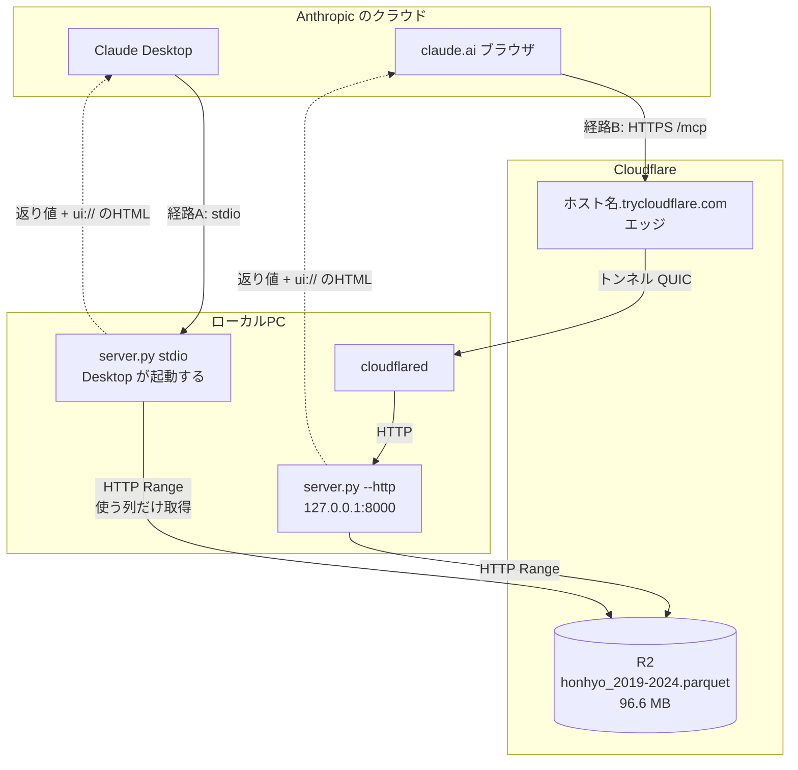

# claude.ai から使う（リモートコネクタ）

Claude Desktop はこのPCの `server.py` を stdio で起動して使う。claude.ai（ブラウザ）は
ローカルのプロセスを起動できないので、**HTTP で待ち受けて公開URLを与える**必要がある。

この文書は、その一時的な公開（quick tunnel）の手順と、起動・終了の仕方をまとめたもの。
恒久化（固定URL・PC非依存）は issue #3 で、ここはその前段の確認用。

---

## 構成

**LLM もデータも既にクラウドにある。** ローカルにあるのは集計する部分だけで、
経路が2本あるのはその1本をどうやって外から呼ばせるかの違いでしかない。



経路 [A] と [B] は**別プロセスで、互いを知らない**。同時に動かしてよい。

| | [A] Claude Desktop | [B] claude.ai |
|---|---|---|
| 起動 | Desktop が stdio で自動起動 | `--http` で手動。トンネルが要る |
| PCを落とすと | 使えない | 使えない（quick tunnel の場合） |
| ビューの描画 | **確認済み** | **確認済み**（2026-09-15） |
| 他人に配れるか | 各自がPython+リポジトリを入れる必要あり | 組織にコネクタを追加すれば不要 |
| 追加できる人 | 自分 | **組織の Owner のみ**（Team/Enterprise） |

### 図の3つの言葉

**cloudflared** — Cloudflare が配っている実行ファイル1つ（`C:\Program Files (x86)\cloudflared\cloudflared.exe`）。
役割は**中継だけ**で、集計のことは何も知らない。外から来た HTTP リクエストを
`127.0.0.1:8000` の `server.py` に渡し、返ってきたものを送り返す。

**ホスト名.trycloudflare.com（エッジ）** — Cloudflare が世界中に持っているサーバーのうち、
いちばん近い1台。claude.ai からのリクエストはまずここに届く。`trycloudflare.com` は
quick tunnel 専用のドメインで、**ホスト名は起動のたびに Cloudflare が勝手に割り当てる**
（`organisation-dennis-book-curve` のような3〜4語の組み合わせ）。ログの `location=nrt09` が
どのエッジに繋がったかで、`nrt` は成田。

**トンネル QUIC** — **接続を張る向きが図の矢印と逆である**ことが、ここでいちばん大事な点。
矢印はリクエストが流れる向きを描いているが、接続自体は `cloudflared` の起動時に
**ローカルPCから外へ**張っている。外から穴を開けてもらうのではないので、
**ルータのポート開放もファイアウォールの設定も要らない**。この張りっぱなしの1本を
トンネルと呼ぶ。

QUIC はその1本が喋っているプロトコル。UDP の上に乗る、HTTP/3 が使っているのと同じもの。
`cloudflared` は起動時に TCP と QUIC のどちらが通るかを試して選ぶ。

```
suggested_protocol=quic
Registered tunnel connection connIndex=0 ... ip=198.41.192.167 location=nrt09 protocol=quic
```

**QUIC が選ばれるかは環境次第**で、UDP が塞がれている社内網などでは TCP（http2）に落ちる。
動作としては同じなので、図のラベルとしては「トンネル」が本質で QUIC は実装詳細。

なお **Cloudflare は図に2回出てくるが、R2（データの置き場）とトンネルは別物**。
cloudflared を止めても R2 のデータは消えないし、Claude Desktop 経由の集計も動く。
止まるのは claude.ai からの経路だけ。

---

## サーバーの起動と終了

サーバーには2つの動かし方がある。**同時に両方動かしてよい**（別プロセスで、互いに知らない）。
データは R2 上の読み取り専用 Parquet なので競合しない。

### A. stdio（Claude Desktop 用）

Claude Desktop が自分で起動・終了する。**手で起動する必要はない。**

```
設定 → 開発者 → ローカルMCPサーバー → npa-traffic-accident
  コマンド: C:\Users\yshiw\AppData\Local\Programs\Python\Python312\python.exe
  引数:     C:\Users\...\npa-traffic-accident-analytics\mcp_server\server.py
```

コードを変えたあと反映したいときは、Claude Desktop を再起動する
（プロセスを手で kill すると Desktop 側が繋ぎ直せずに固まることがある）。

### B. HTTP（claude.ai / basic-host 用）

```bash
python mcp_server/server.py --http --port 8000 --allow-host <公開ホスト名>
```

`MCP endpoint: http://127.0.0.1:8000/mcp` と出れば起動。繋ぎっぱなしになる。

`--allow-host` は DNS リバインディング対策の Host ヘッダ検証に要る。既定では
`localhost` と `127.0.0.1` しか通らないので、**トンネル越しに公開するときは
そのホスト名を渡さないと全リクエストが弾かれる**。

終了は Ctrl+C。バックグラウンドに回してしまった場合は PID で落とす。

```bash
netstat -ano | grep -E ":8000\s+.*LISTENING"   # 右端が PID
taskkill //PID <PID> //F
```

---

## quick tunnel で公開する

`cloudflared` はインストール済み。アカウント登録も設定ファイルも要らない。

### 1. トンネルを立てる

```bash
cloudflared tunnel --url http://127.0.0.1:8000
```

`https://<ランダムな名前>.trycloudflare.com` が表示される。**繋ぎっぱなしにする。**

`--url http://localhost:8000` と書くと、`localhost` が IPv6 の `::1` に解決されて
127.0.0.1 で待っているサーバーに届かず 502 になることがある。**`127.0.0.1` と書くほうが確実。**

### 2. サーバーを起動する

トンネルのホスト名が分かってからでないと `--allow-host` を書けないので、この順になる。

```bash
python mcp_server/server.py --http --port 8000 --allow-host <ホスト名>.trycloudflare.com
```

### 3. claude.ai に登録する

**組織設定（Organization settings）→ コネクタ** から追加する。個人の設定画面には出ない。

- **URL: `https://<ホスト名>.trycloudflare.com/mcp`** — 末尾の `/mcp` が要る。ルートは 404
- 認証（OAuth の Client ID / Secret）は**設定不要**。未認証のURLも登録できる

**Team / Enterprise では、カスタムコネクタを追加できるのは組織の Owner だけ**
（[公式ヘルプ](https://support.anthropic.com/en/articles/11175166-getting-started-with-custom-connectors-using-remote-mcp)）。
Owner が組織に追加したあと、各メンバーが個別に有効化する。
「カスタムコネクタを追加」が見当たらない場合は権限がない。

さらに **Owner はインタラクティブなコネクタのツール呼び出しを個別に無効化できる**。
ビューを作っても組織側で止められうるので、配布時は Owner と合意しておくこと。

### 4. 終了と後始末

1. claude.ai からコネクタを削除する（URLは次回変わるので残しても繋がらない）
2. トンネルを Ctrl+C（または `taskkill //IM cloudflared.exe //F`）
3. サーバーを Ctrl+C

---

## 注意

- **quick tunnel の URL は毎回変わる。** PC を落とすと使えない。恒久運用には使えない（issue #3）
- **Claude Desktop 側でこのリモートコネクタを有効にしない。** 開発者タブの stdio と
  同じツールが2組並んで紛らわしくなる。確認中は claude.ai だけで有効にする
- **公開中は `run_sql`（任意の SELECT を通す口）も外から叩ける。** URL を知られない限り
  届かないし、読み取り専用の公開データなので実害は考えにくいが、立てっぱなしにはしない
- Anthropic 側から公開インターネット経由で到達できる必要がある。社内網・VPN の内側は不可

---

## 確認済みのこと（2026-09-15）

quick tunnel + 個人アカウントの claude.ai で、**表・グラフ・地図の3つとも描画された**。

- **Anthropic のクラウドからトンネル越しに到達できる** — `--allow-host`、`/mcp` パス、
  streamable-http のいずれも問題なし
- **claude.ai は `ui://` の紐づけを認識する** — コネクタのツール一覧で
  「インタラクティブツール」として3本が分類される
- **`_meta.ui.csp` の外部ドメイン宣言が通る** — 地図の背景（地理院ベクトルタイル）が表示された。
  Artifact と違い、MCP Apps のビューは宣言したドメインへ通信できる

つまり**恒久ホスティングは純粋に「どこに置くか」の問題**であり、
描画されるかどうかの不確実性は残っていない。

残る制約は権限のほう。**Team/Enterprise で組織にコネクタを追加できるのは Owner だけ**で、
Owner でないアカウントには組織設定そのものが表示されない。同僚に配る段では
Owner の関与が要る（上の「3. claude.ai に登録する」を参照）。

---

## 関連

- ローカルでの描画確認（公式 basic-host + puppeteer）は開発時の手順。リポジトリには入れない
- 恒久ホスティングと認証の検討は issue #3
- 仕組みの説明は [HOW_IT_WORKS.md](HOW_IT_WORKS.md)、構成は [DESIGN.md](DESIGN.md)
